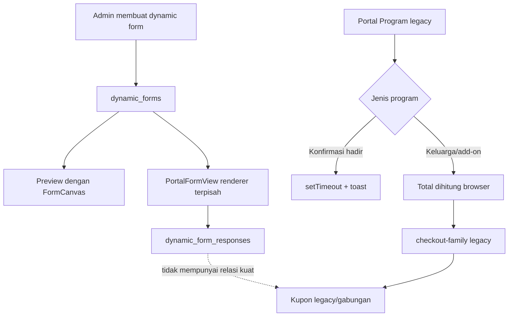
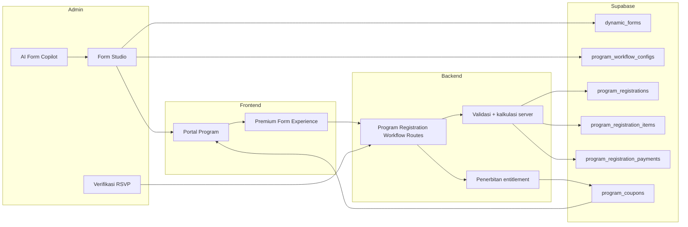
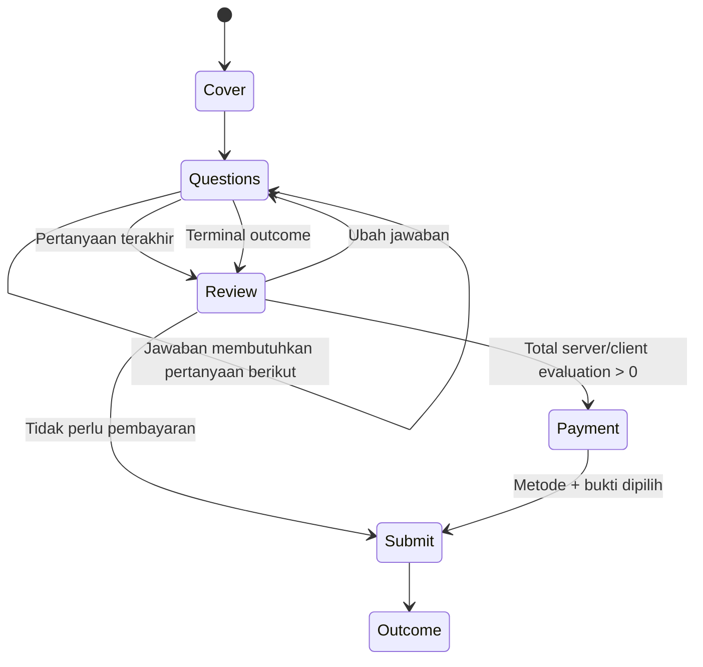
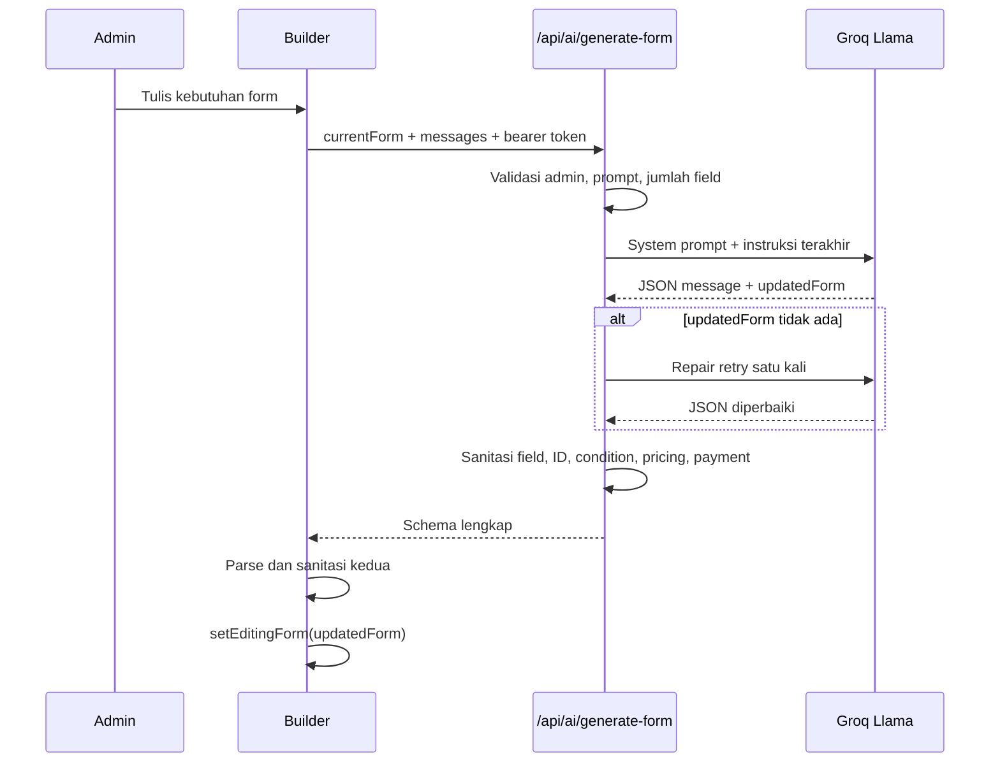
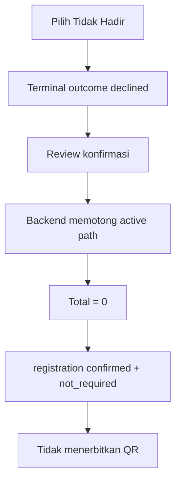
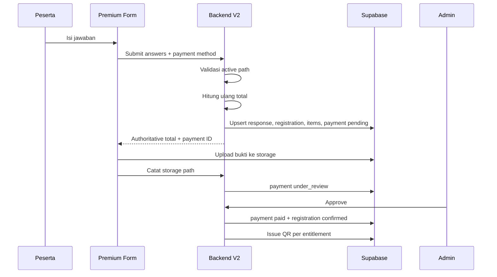
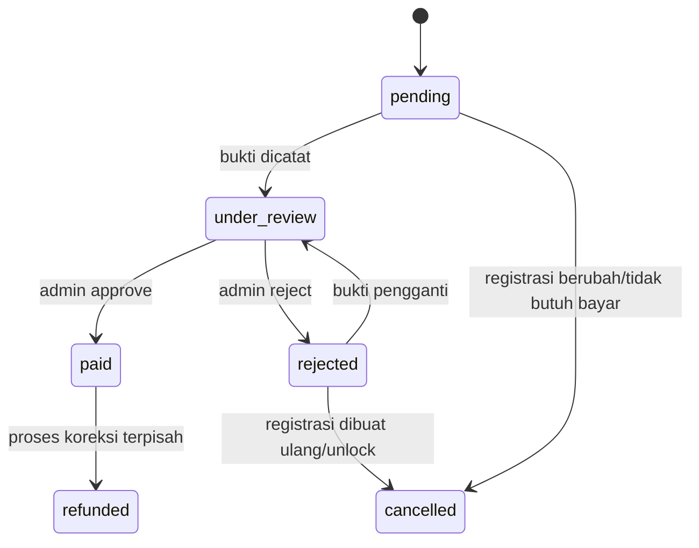

# SPS Corner Form Studio & Program Workflow V2

## Dokumen Review, Penjelasan Perubahan, dan Handoff Agent

> Tanggal audit terakhir: 12 Juli 2026 (Asia/Makassar)<br>
> Base commit yang diaudit: `5383540` (`main`, sama dengan `origin/main`)<br>
> Versi fitur utama: `v5.8.0`<br>
> Versi hardening server: `v5.8.1`<br>
> Versi dokumentasi handoff ini: `v5.8.2`<br>
> Dokumen schema teknis pendamping: `docs/form-workflow-v2-schema.md`

Dokumen ini dibuat sebagai sumber pemahaman bersama dan memori jangka panjang. Agent berikutnya harus membaca dokumen ini sebelum mengubah Form Builder, AI Form Copilot, formulir portal, program kerja, pembayaran RSVP, atau QR program.

---

## 1. Ringkasan Eksekutif

Perubahan yang dilakukan bukan hanya mengganti warna atau CSS. Implementasi dibagi menjadi empat lapisan:

1. **Form Studio baru untuk admin**: builder tiga area yang memisahkan daftar field, canvas, dan inspector.
2. **Form Experience V2 untuk pengisi**: cover acara, satu pertanyaan per langkah, conditional path, review, rincian biaya, pembayaran, dan outcome.
3. **Workflow program server-authoritative**: identitas, validasi, kalkulasi, pembayaran, dan penerbitan QR diproses backend.
4. **Fondasi data baru**: registrasi program, item biaya, pembayaran, relasi kupon, dan audit scan.

Status aktual saat dokumen ini dibuat:

| Bagian | Status | Keterangan |
|---|---|---|
| UI Form Studio baru | **Implemented** | Sudah ada di frontend produksi. |
| Premium Form Experience V2 | **Implemented** | Preview admin dan portal memakai komponen yang sama. |
| AI menghasilkan dan menerapkan schema | **Implemented in code** | Production memiliki `GROQ_API_KEY`; pengujian live dengan sesi admin tetap perlu dilakukan saat review. |
| Backend registrasi RSVP V2 | **Deployed** | API VPS sehat dan route sudah aktif. |
| Database Workflow V2 | **Blocked** | Migration `006` belum dijalankan; Supabase masih mengembalikan `PGRST205`. |
| Pembayaran transfer/QRIS manual | **Implemented, blocked by DB** | Bukti ditahan untuk verifikasi admin. |
| QR terpisah per penerima/manfaat | **Implemented, blocked by DB** | Penerbitan ada di backend, belum dapat berjalan tanpa migration. |
| Scanner QR legacy | **Existing/compatible by design** | Kupon V2 menulis kolom legacy/current, tetapi E2E scan V2 belum diverifikasi. |
| Audit scan append-only V2 | **Schema only** | Tabel disiapkan, tetapi scanner masih memakai RPC legacy. |

Kesimpulan penting: **kode UI dan backend sudah dideploy, tetapi workflow RSVP V2 belum boleh disebut aktif penuh sampai migration 006 dijalankan dan pilot E2E lulus.**

---

## 2. Timeline Perubahan

| Fase | Commit | Isi utama |
|---|---|---|
| Baseline builder/portal | `f4edd7f` | Dynamic form engine, kondisi, AI generation, builder awal. |
| Stabilitas V1/v5.7 | `a6d75f2` | AI diwajibkan menghasilkan schema, Card Form conditional diperbaiki, sanitasi ID/condition, UI builder responsif tahap awal. |
| Perombakan V2/v5.8.0 | `6fcb83f` | Form Studio modular, Premium Form Experience, RSVP program, pembayaran manual, admin verification, backend dan migration. |
| Hardening/v5.8.1 | `5383540` | Active terminal path, validasi repeater/opsi/angka di server, metode pembayaran authoritative, sinkronisasi versi. |

Pemisahan fase ini penting. Keluhan awal bahwa AI hanya membalas chat mulai ditangani pada v5.7. Perubahan v5.8 memperluasnya agar schema AI bisa menghasilkan repeater, terminal outcome, harga, pembayaran, dan automasi program.

---

## 3. Masalah dan Workflow Lama

### 3.1 Builder lama

Sebelum Form Studio V2, `AdminFormBuilder.tsx` menangani terlalu banyak tanggung jawab sekaligus:

- daftar field;
- drag/drop;
- canvas;
- editor setiap field;
- design panel;
- AI chat;
- preview;
- penyimpanan dan targeting.

Field diedit melalui komponen inline besar seperti `FieldCard`, `FieldEditor`, dan `DesignPanel` di file yang sama. Dampaknya:

- canvas lebih terasa seperti daftar pengaturan daripada representasi form;
- ruang kerja cepat sempit;
- field dan panel saling berebut ruang;
- perubahan UI sulit diuji dan dipelihara;
- tampilan belum memberi kesan produk form builder profesional.

### 3.2 AI lama

Pada implementasi awal, model dapat mengembalikan respons ramah berbentuk chat tanpa schema yang dapat diterapkan. UI lalu terlihat seperti berhasil karena ada jawaban AI, padahal `editingForm.fields` tidak berubah.

Pada fase v5.7 sudah ditambahkan kewajiban `updatedForm`, repair retry, sanitasi, dan penerapan ke canvas. Kekurangan yang masih ada sebelum v5.8 adalah schema belum mengerti repeater keluarga, terminal outcome, payment rules, dan automasi program secara lengkap.

### 3.3 Form pengisi lama

Portal memakai renderer sendiri di `PortalFormView.tsx`, sedangkan preview builder memakai `FormCanvas`. Walaupun keduanya membaca schema serupa, perilakunya dapat berbeda:

- evaluasi conditional tidak selalu identik;
- index Card Form dapat menunjuk ke field yang sudah tidak visible;
- hidden answer dapat tetap memengaruhi total atau validasi;
- hasil di preview tidak selalu sama dengan sudut pandang pengisi.

Form legacy menyimpan jawaban langsung ke `dynamic_form_responses`. Ia tidak mempunyai aggregate registrasi program, price snapshot authoritative, payment ledger, atau relasi entitlement.

### 3.4 Program kerja lama

Untuk gathering/turnamen tanpa dynamic form V2, `PortalProgram.tsx` masih memiliki jalur legacy:

- tombol konfirmasi hadir menjalankan `setTimeout` dan toast;
- tombol polling juga menjalankan simulasi toast;
- add-on keluarga dihitung di browser;
- checkout keluarga mengirim `userId`, `familyCount`, dan `totalAmount` dari browser;
- kupon keluarga lama dapat berupa kupon gabungan.

Jalur ini **belum dihapus** karena dipertahankan sebagai fallback untuk program legacy yang tidak memiliki `dynamic_form_id`.

### 3.5 Diagram workflow lama



Masalah utamanya bukan sekadar tampilan. Form response, status hadir, biaya, pembayaran, dan kupon tidak berada dalam satu workflow yang auditable.

---

## 4. Arsitektur Workflow Sekarang



Catatan batas kepercayaan:

- Admin browser masih boleh menulis **konfigurasi** `program_workflow_configs` melalui RLS admin.
- Respondent browser tidak boleh menulis tabel transaksi workflow secara langsung.
- Registrasi, harga, pembayaran, dan entitlement ditulis oleh backend service-role.
- Browser boleh mengunggah file bukti ke storage sesuai policy, lalu backend mencatat storage path-nya.

---

## 5. Perubahan UI/UX Form Studio

### 5.1 Struktur tiga area

Form Studio sekarang dibagi menjadi:

| Area | Komponen | Fungsi |
|---|---|---|
| Kiri | `FieldPalette.tsx` | Mencari, memilih, dan drag field berdasarkan kelompok. |
| Tengah | `BuilderCanvas.tsx` | Representasi visual form, selection, insertion point, reorder, duplicate, delete. |
| Kanan | `InspectorPanel.tsx` | Tab Field, Logic, Design, Setup, dan AI. |
| Atas | `BuilderTopbar.tsx` | Judul, device switcher, save, preview, publish. |
| Preview | `DevicePreview.tsx` | Lebar desktop/tablet/mobile. |

Pada tablet/mobile, palette dan inspector berubah menjadi drawer agar canvas tidak terpotong.

### 5.2 Komponen builder baru

- `BuilderTopbar.tsx`: toolbar global dan status penyimpanan.
- `FieldPalette.tsx`: field library searchable dan draggable.
- `BuilderCanvas.tsx`: canvas WYSIWYG builder.
- `DevicePreview.tsx`: wrapper ukuran perangkat.
- `InspectorPanel.tsx`: shell tab inspector dan design controls.
- `FieldSettingsPanel.tsx`: editor tipe field, opsi, harga, repeater, rekening, dan payment method.
- `LogicFlowPanel.tsx`: urutan field, condition editor, terminal outcome, dan deteksi reference condition rusak.
- `types.ts` dan `index.ts`: contract serta barrel export komponen.

### 5.3 Tipe field yang tersedia

```text
text, textarea, number, select, radio, checkbox, image_choice,
rating, scale, date, file_upload, image, addon_group,
repeater, payment_section
```

Penambahan penting adalah `repeater` untuk satu baris per anggota keluarga. Field ini mempunyai:

- `subfields`;
- `min_items`;
- `max_items`;
- `item_label`;
- `item_unit_price`.

### 5.4 Logic flow

Conditional disimpan pada field tujuan:

```json
{
  "id": "shirt_size",
  "condition": {
    "fieldId": "attendance",
    "operator": "eq",
    "value": "yes"
  }
}
```

Operator yang didukung:

- `eq`: tampil jika jawaban sama;
- `neq`: tampil jika jawaban berbeda;
- `in`: tampil jika jawaban termasuk daftar nilai.

Terminal outcome disimpan pada opsi:

```json
{
  "value": "no",
  "label": "Tidak dapat hadir",
  "outcome_id": "declined"
}
```

Ketika opsi terminal dipilih, seluruh field setelahnya dikeluarkan dari active path, validasi, kalkulasi, dan persistence.

### 5.5 Responsive dan aksesibilitas

Perubahan mencakup:

- layout desktop/tablet/mobile;
- drawer responsif;
- keyboard selection dengan Enter/Space;
- navigasi tab dengan Arrow Left/Right, Home, dan End;
- `aria-label`, `role=tab`, `role=switch`, dan focus ring;
- rekening berubah menjadi satu kolom pada panel sempit.

---

## 6. Perubahan Form Experience untuk Pengisi

### 6.1 Satu renderer V2 bersama

`PremiumFormExperience.tsx` dipakai oleh:

- preview admin;
- portal pengisi.

Ini menghilangkan perbedaan perilaku antara apa yang dilihat admin dan responden untuk form V2.

### 6.2 Komponen experience

| Komponen | Fungsi |
|---|---|
| `FormExperienceShell.tsx` | Shell, header, progress, footer, responsive container. |
| `EventCover.tsx` | Cover acara, banner, highlights, CTA mulai. |
| `ChoiceCard.tsx` | Pilihan radio/checkbox berbentuk kartu. |
| `FamilyRepeater.tsx` | Tambah/hapus anggota keluarga dan detail per orang. |
| `ReviewStep.tsx` | Review jawaban sebelum submit. |
| `OrderSummary.tsx` | Item biaya, quantity, harga, total. |
| `ManualPaymentStep.tsx` | Instruksi transfer/QRIS dan upload bukti. |
| `OutcomeScreen.tsx` | Sukses, declined, pending, atau error outcome. |

### 6.3 Tahapan experience



### 6.4 Draft dan status existing

- Jawaban V2 disimpan ke `localStorage` menggunakan key form + user.
- Jika backend memiliki registrasi draft atau payment pending tanpa bukti, jawaban lama dimuat kembali.
- Jika registrasi sudah final/pending review/paid, portal membuka outcome screen, bukan form edit.

---

## 7. Workflow Template RSVP yang Dibuat

Template berada di `src/utils/formTemplates.ts`.

### 7.1 Struktur default

1. **Apakah hadir?**
   - `yes`: lanjut.
   - `no`: terminal outcome `declined`.
2. **Ukuran baju**: S, M, L, XL, XXL, XXXL.
3. **Apakah camping?**
   - `no`: tidak menanyakan keluarga.
   - `yes`: lanjut ke pertanyaan keluarga.
4. **Apakah membawa keluarga?**
5. **Data anggota keluarga**: satu repeater row per orang.
6. **Payment section**: hanya masuk tahap pembayaran jika total positif.

### 7.2 Nilai default yang harus dipahami

- surcharge XXL default: `0`;
- surcharge XXXL default: `0`;
- biaya keluarga per orang default: `0`;
- maksimal keluarga default: `5`;
- nama anggota keluarga default wajib;
- rekening dan QRIS default belum diisi.

Artinya template adalah **struktur siap konfigurasi**, bukan harga produksi siap pakai.

### 7.3 Outcome default

- `declined`: tidak hadir, tidak menerbitkan entitlement;
- `confirmed`: hadir dan selesai tanpa tagihan;
- `pending_payment`: bukti menunggu admin.

---

## 8. Cara Kerja AI Form Copilot Sekarang

### 8.1 Alur request



### 8.2 Pengamanan AI

- hanya admin/superadmin;
- rate limit 10 request/menit;
- instruksi maksimal 4.000 karakter;
- maksimal 100 field;
- output diminta sebagai JSON object;
- ID form dari AI tidak dipercaya;
- field ID dinormalisasi dan dibuat unik;
- condition hanya boleh mengarah ke parent sebelumnya;
- option label kosong dibuang;
- payment `verify_with_ai` dipaksa `false`;
- jika setelah retry tidak ada schema, API mengembalikan error, bukan sukses chat palsu.

### 8.3 Kemampuan schema AI V2

AI dapat menghasilkan:

- theme dan Card Form;
- repeater + subfields;
- option/number/repeater/add-on pricing;
- terminal outcome;
- manual bank transfer dan QRIS;
- program automation mapping.

### 8.4 Batasan saat ini

- UI menampilkan riwayat chat, tetapi backend hanya mengirim system prompt dan **instruksi user terakhir** ke model. Konteks follow-up terutama berasal dari `currentForm`, bukan seluruh percakapan.
- Local `.env` belum memiliki `GROQ_API_KEY`; production VPS terkonfirmasi memilikinya.
- Belum ada live E2E test dengan sesi admin dalam audit dokumentasi ini.

---

## 9. Penyimpanan Form dan Hubungan ke Program

### 9.1 Data form

Schema pertanyaan disimpan di:

- `dynamic_forms.fields`: array field;
- `dynamic_forms.description`: JSON string yang juga memuat text description, theme, layout, outcomes, review, draft, dan program automation.

Contoh metadata dalam `description`:

```json
{
  "text": "Deskripsi form",
  "experience_version": 2,
  "layout_type": "card",
  "theme_config": {},
  "outcomes": [],
  "review_enabled": true,
  "autosave_draft": true,
  "program_automation": {}
}
```

### 9.2 Linking program

Saat admin memilih program dan menyimpan:

1. Form disimpan ke `dynamic_forms`.
2. `union_programs.dynamic_form_id` diisi.
3. Untuk experience V2, builder membentuk payload melalui `createProgramWorkflowConfig()`.
4. Builder mencari workflow aktif.
5. Jika ada, config aktif di-update.
6. Jika belum ada, versi terbaru + 1 dibuat.

Semantic binding yang dibuat:

| Arti | Field key |
|---|---|
| Kehadiran | `attendance` |
| Ukuran baju | `shirt_size` |
| Camping | `camping` |
| Membawa keluarga | `bringing_family` |
| Jumlah/data keluarga | `family_count` |

Builder menemukan field berdasarkan explicit automation ID, `system_key`, atau fallback ID.

### 9.3 Save guard

Form V2 dengan harga positif tidak dapat disimpan jika:

- belum terhubung ke program;
- bank transfer aktif tetapi rekening belum lengkap;
- QRIS aktif tetapi gambar QRIS belum diisi;
- tidak ada metode pembayaran aktif.

---

## 10. Workflow Responden Sekarang

### 10.1 Membuka program

1. Portal mengambil program aktif.
2. Jika `dynamic_form_id` tersedia, portal menampilkan CTA **Buka formulir RSVP**.
3. URL menuju `/portal/forms/:formId?programId=:programId`.
4. `PortalFormView` mengambil schema `dynamic_forms`.
5. Jika `experience_version === 2`, ia memakai `PremiumFormExperience`.

Program tanpa `dynamic_form_id` tetap memakai workflow legacy.

### 10.2 Cabang tidak hadir



Jawaban ukuran baju/camping/keluarga yang dipaksakan dari client tidak ikut disimpan atau dihitung.

### 10.3 Hadir tanpa biaya tambahan

1. Server memvalidasi attendance, ukuran, camping, dan keluarga yang visible.
2. Server menghitung quote `0`.
3. Registrasi menjadi `confirmed` + `not_required`.
4. Entitlement karyawan diterbitkan langsung.
5. Jika ada keluarga tanpa biaya, entitlement per keluarga juga diterbitkan.

### 10.4 Hadir dengan biaya tambahan



Browser tidak menentukan status paid atau menerbitkan QR.

---

## 11. Kalkulasi Harga Server

Backend memakai `buildRegistrationQuote()`.

### 11.1 Item yang didukung workflow RSVP

- surcharge ukuran baju;
- tiket masuk keluarga;
- uang makan keluarga;
- quantity berdasarkan jumlah repeater row.

### 11.2 Aturan kepercayaan

- total browser diabaikan;
- NIK/user dari request body diabaikan;
- identitas diambil dari bearer token dan `profiles`;
- pilihan harus cocok dengan options form;
- angka harus finite dan berada di min/max;
- repeater harus array object valid;
- subfield wajib setiap anggota diperiksa;
- maksimal hard limit keluarga di server: 20;
- maksimal payload: 150 field dan 150 KB;
- maksimal total: Rp100.000.000.

### 11.3 Snapshot

Server menyimpan:

- jawaban active path;
- item biaya hasil kalkulasi;
- pricing rules dan workflow version saat kalkulasi;
- answer hash canonical untuk idempotency.

---

## 12. Workflow Pembayaran

### 12.1 Metode

- `bank_transfer`;
- `manual_qris`.

Metode yang dikirim client harus termasuk daftar metode pada workflow. Jika tidak, backend memakai metode default yang sah.

### 12.2 Status pembayaran



### 12.3 Bukti pembayaran

- frontend menerima JPG/PNG/WEBP maksimal 8 MB;
- file diunggah ke bucket `program-files`;
- backend menerima storage path aman atau URL HTTPS dari origin yang diizinkan;
- storage path diubah menjadi signed URL satu jam saat admin melihat data;
- upload bukti hanya mengubah status menjadi `under_review`.

### 12.4 Admin verification

Halaman `/dashboard/admin/program-registrations` menyediakan:

- filter under review, pending, paid, failed, all;
- pencarian nama, NIK, dan program;
- total biaya dan jumlah keluarga;
- signed link bukti;
- approve + catatan;
- reject + alasan wajib;
- unlock terbatas.

Approve akan:

1. memastikan bukti berada di status `under_review`;
2. memastikan amount cocok dengan registrasi;
3. mengubah payment menjadi `paid`;
4. mengubah registration menjadi `confirmed`;
5. menerbitkan entitlement yang belum ada;
6. mengirim notifikasi.

---

## 13. Workflow QR dan Entitlement

### 13.1 Bentuk entitlement

Jika satu karyawan membawa dua anggota keluarga dan semua entitlement aktif, row yang dihasilkan:

| Penerima | Entitlement | Jumlah QR |
|---|---|---:|
| Karyawan | Attendance | 1 |
| Karyawan | Meal | 1 |
| Keluarga 1 | Attendance | 1 |
| Keluarga 1 | Meal | 1 |
| Keluarga 2 | Attendance | 1 |
| Keluarga 2 | Meal | 1 |
| **Total** |  | **6** |

### 13.2 Idempotency kupon

Unique key logis:

```text
registration + entitlement_code + beneficiary_type + beneficiary_index
```

Retry approval tidak boleh membuat QR duplikat.

### 13.3 Kompatibilitas legacy

Backend mendeteksi apakah `program_coupons` memakai:

- `coupon_code` + `gate_type`;
- `qr_code` + `barcode` + `coupon_type`;
- atau keduanya.

Backend mengisi bentuk yang tersedia agar portal/scanner lama tetap dapat membaca kupon.

### 13.4 Scanner saat ini

`AdminScanner.tsx` masih menjalankan RPC legacy:

```text
claim_program_coupon(p_coupon_code, p_admin_id)
```

Tabel `program_coupon_redemptions` sudah dirancang oleh migration 006, tetapi belum ada kode scanner yang menulis audit append-only tersebut. Karena itu:

- generation/display QR V2 sudah diimplementasikan;
- compatibility dengan scanner lama dirancang;
- audit scan V2 yang immutable belum diintegrasikan;
- E2E scan kupon employee/family V2 wajib menjadi tahap review tersendiri.

---

## 14. Model Data V2

### 14.1 `program_workflow_configs`

Menyimpan:

- program dan dynamic form;
- version dan active flag;
- semantic field bindings;
- pricing rules;
- entitlement rules;
- payment rules;
- metadata generator.

Satu program hanya boleh memiliki satu config aktif.

### 14.2 `program_registrations`

Satu aggregate per program + NIK/user:

- attendance status;
- registration status;
- shirt/camping/family summary;
- total;
- payment status;
- answers snapshot;
- pricing snapshot;
- audit metadata.

### 14.3 `program_registration_items`

Line item hasil server:

- item code/name/type;
- beneficiary;
- quantity;
- unit price;
- total;
- metadata.

### 14.4 `program_registration_payments`

Ledger pembayaran:

- expected dan paid amount;
- payment method/provider;
- reference dan idempotency key;
- proof path/metadata;
- status;
- verifier dan timestamps.

### 14.5 Perubahan `program_coupons`

Migration menambahkan tujuh kolom:

- `program_registration_id`;
- `program_registration_item_id`;
- `beneficiary_type`;
- `beneficiary_index`;
- `entitlement_code`;
- `entitlement_metadata`;
- `issued_at`.

### 14.6 `program_coupon_redemptions`

Fondasi audit scan:

- success;
- duplicate;
- rejected;
- reversed.

Seperti dijelaskan sebelumnya, tabel ini belum dipakai scanner saat ini.

---

## 15. State Model Registrasi

| Skenario | attendance_status | registration_status | payment_status | QR |
|---|---|---|---|---|
| Tidak hadir | `declined` | `confirmed` | `not_required` | Tidak ada |
| Hadir, total 0 | `attending` | `confirmed` | `not_required` | Langsung diterbitkan |
| Hadir, total > 0 | `attending` | `pending_payment` | `pending` | Ditahan |
| Bukti diunggah | `attending` | `pending_payment` | `under_review` | Ditahan |
| Bukti ditolak | `attending` | `pending_payment` | `failed` pada registration, `rejected` pada payment | Tidak ada |
| Bukti disetujui | `attending` | `confirmed` | `paid` | Diterbitkan |
| Admin unlock non-paid | mengikuti jawaban lama | `draft` | `failed`/`not_required` | QR belum claimed dinonaktifkan |

Edit dikunci jika:

- bukti sedang ditinjau;
- konfirmasi tidak hadir sudah final;
- payment sudah paid;
- kupon active/claimed sudah diterbitkan.

Admin unlock menolak registrasi paid dan registrasi dengan QR claimed.

---

## 16. Perbandingan Dulu dan Sekarang

| Area | Dulu | Sekarang |
|---|---|---|
| Builder | Editor field inline dalam satu file besar | Palette + canvas + inspector modular |
| Preview | Renderer admin sendiri | V2 memakai renderer yang sama dengan portal |
| AI | Dapat berhenti pada chat/schema terbatas | Schema wajib, repair retry, langsung `setEditingForm` |
| Conditional | Visible fields dasar | Active path bertingkat + terminal outcome |
| Keluarga | Count/add-on atau kupon gabungan | Repeater per orang + beneficiary index |
| Harga | Banyak kalkulasi di browser | Server menghitung ulang workflow RSVP |
| Pembayaran | Jalur legacy/iPaymu/add-on | Transfer/QRIS manual + proof + admin review |
| Kehadiran | Tombol simulasi pada beberapa program | Registrasi aggregate idempoten untuk program V2 |
| QR | Terpisah dari form response | Terhubung ke registration dan beneficiary |
| Program | Form dan program tidak punya workflow contract | `dynamic_form_id` + semantic workflow config |
| Audit | Response/kupon tersebar | Answer, price, payment, entitlement snapshots |
| Legacy | Satu-satunya jalur | Tetap tersedia untuk program non-V2 |

---

## 17. Hal yang Sudah Selesai, Parsial, dan Belum Selesai

### 17.1 Implemented

- Form Studio modular dan responsif.
- Premium respondent experience.
- Shared preview/respondent renderer V2.
- AI schema execution dengan repair retry.
- Repeater dan terminal outcome.
- Server-side active path validation.
- Server-side RSVP pricing.
- Manual payment proof workflow.
- Admin approve/reject/unlock endpoints.
- QR per employee/family entitlement.
- RLS/migration design.
- Legacy program fallback.
- Regression tests untuk logic, template, config, quote, dan validation.

### 17.2 Partial / perlu keputusan review

| Prioritas | Gap | Dampak |
|---|---|---|
| P0 | Migration 006 belum dijalankan | Seluruh transaksi Workflow V2 belum dapat dipakai. |
| P1 | Save form → link program → workflow config tidak transaksional | Form/program dapat terlanjur tersimpan walau config gagal. Kondisi ini sangat relevan selama migration belum ada. |
| P1 | Bukti yang ditolak tidak kembali ke payment form | Backend menerima bukti pengganti, tetapi portal mengunci registration `failed` pada outcome screen. |
| P1 | Workflow config aktif di-update tanpa increment version | Rule berubah tetapi `version` dapat tetap sama; pricing snapshot masih ada, namun versioning tidak immutable. |
| P1 | Scan audit V2 belum dihubungkan | Scanner tetap memakai RPC legacy dan tidak menulis `program_coupon_redemptions`. |
| P2 | Warna Design mengubah `theme_color`, sementara Premium V2 memprioritaskan `theme.primary_color` | Perubahan warna dapat terlihat di builder tetapi tidak memengaruhi experience V2 template. |
| P2 | Pilihan Classic/Card tidak sepenuhnya berlaku pada V2 | `experience_version=2` selalu memakai Premium step experience. |
| P2 | `review_enabled` disimpan tetapi Premium selalu menampilkan review | Toggle belum menjadi behavior nyata. |
| P2 | `autosave_draft` disimpan tetapi portal selalu diberi `draftKey` | Toggle belum menjadi behavior nyata. |
| P2 | Undo/Redo tampil tetapi disabled | History state belum diimplementasikan. |
| P2 | Save dan Publish memanggil fungsi sama | Belum ada draft/publish lifecycle; payload selalu `is_active=true`. |
| P2 | Builder bisa menyimpan banyak rekening, workflow memakai rekening pertama | Responden hanya melihat rekening pertama. |
| P2 | Builder hanya punya satu biaya keluarga per orang | Backend mendukung `entry_unit_price` dan `meal_unit_price`, tetapi builder memetakan seluruh item price ke entry dan meal selalu 0. |
| P2 | Repeater UI belum mengedit daftar subfield secara lengkap | Template punya `name`; schema yang lebih kompleks lebih mudah dibuat AI/kode. |
| P2 | `proof_required=false` belum menjadi jalur settlement lain | Premium tetap meminta proof ketika total positif. |
| P2 | `hold_entitlements_until_paid` tersimpan tetapi backend selalu menahan paid workflow | Aman, tetapi toggle konfigurasi belum efektif. |
| P2 | AI UI menyimpan chat, model hanya mendapat instruksi terakhir | Follow-up bergantung pada current form, bukan full conversational context. |
| P2 | Unlink/relink program belum membersihkan link/config lama | Memilih “Tidak terhubung” tidak menjalankan update untuk menghapus relasi lama. |
| P3 | `dynamic_forms.description` menampung JSON metadata | Bekerja, tetapi bukan model data yang ideal untuk jangka panjang. |

### 17.3 Di luar perubahan ini

- Desain ulang halaman program legacy selain CTA V2.
- Refund/reconciliation paid registration.
- Gateway otomatis untuk RSVP; implementasi saat ini manual transfer/QRIS.
- Backfill program/form/kupon lama ke V2.
- Penghapusan jalur legacy.
- Perbaikan seluruh vulnerability dependency proyek.

---

## 18. Status Deployment dan QA

### 18.1 Deployment

- GitHub `main` dan local base sama pada `5383540` sebelum dokumen v5.8.2 dibuat.
- Frontend produksi telah menampilkan v5.8.1.
- Backend VPS menjalankan route V2.
- `GET https://api.spscorner.store/api/test-ping` sehat saat audit.
- Route V2 tanpa token mengembalikan JSON `401`, bukan HTML.
- Supabase `program_workflow_configs` mengembalikan `404/PGRST205`; migration belum diterapkan.

### 18.2 Automated QA terakhir

```text
npm run lint          PASS
npm test -- --run     PASS — 10 files / 53 tests
npm run build         PASS
git diff --check      PASS
```

Build masih memberikan warning chunk utama lebih dari 500 KB. Warning ini bukan kegagalan build, tetapi perlu performance review terpisah.

Audit dependency produksi terakhir:

```text
16 vulnerabilities: 2 low, 7 moderate, 7 high, 0 critical
```

Tidak dilakukan `npm audit fix` otomatis karena dapat menghasilkan breaking dependency changes.

### 18.3 QA yang belum dilakukan

- authenticated visual E2E Form Studio di browser;
- AI live generate dengan user admin;
- migration staging dan production;
- submit RSVP menggunakan data production-like;
- approve/reject/re-upload proof;
- scan seluruh QR employee/family attendance/meal;
- concurrency approval dan duplicate scan;
- responsive screenshot comparison terhadap target desain yang disepakati.

---

## 19. Urutan Review yang Disarankan

Jangan mengubah semuanya sekaligus. Review dan setujui dalam urutan berikut.

### Review 1 — Bahasa desain Form Studio

File utama:

- `src/pages/dashboard/admin/AdminFormBuilder.tsx`
- `src/components/form-builder/*`

Keputusan yang dibutuhkan:

- struktur sidebar/canvas/inspector final;
- spacing, typography, warna, border, shadow;
- seberapa dekat behavior yang diinginkan dengan Jotform;
- apakah Save dan Publish harus dipisahkan;
- apakah undo/redo wajib pada fase berikut.

Acceptance criteria:

- desktop, tablet, mobile tidak overflow;
- field dapat ditambah, dipilih, dipindah, diduplikasi, dan dihapus;
- semua pengaturan penting ditemukan tanpa mengedit JSON.

### Review 2 — Bahasa desain Form Pengisi

File utama:

- `src/components/forms/PremiumFormExperience.tsx`
- `src/components/forms/experience/*`

Keputusan:

- cover, question card, review, payment, outcome;
- tema visual final;
- classic vs card behavior;
- apakah review dapat dimatikan;
- autosave behavior.

### Review 3 — Schema dan Logic

File utama:

- `src/types/form.ts`
- `src/utils/formLogic.ts`
- `src/utils/formWorkflow.ts`
- `src/components/form-builder/LogicFlowPanel.tsx`

Keputusan:

- operator logic yang dibutuhkan;
- terminal outcome;
- repeater subfields;
- behavior ketika parent answer berubah.

### Review 4 — Template RSVP dan Harga

File utama:

- `src/utils/formTemplates.ts`
- `src/utils/programWorkflowConfig.ts`
- `src/components/form-builder/FieldSettingsPanel.tsx`

Keputusan wajib:

- surcharge XXL;
- surcharge XXXL;
- tiket keluarga per orang;
- uang makan keluarga per orang;
- maksimal anggota;
- data apa saja yang dikumpulkan per anggota;
- satu atau banyak rekening;
- aturan transfer dan QRIS.

### Review 5 — Save, Link, dan Versioning

File utama:

- `src/pages/dashboard/admin/AdminFormBuilder.tsx`
- `database/migrations/006_program_registration_workflow_v2.sql`

Harus diselesaikan sebelum pilot:

- atomic save atau rollback compensation;
- unlink/relink program;
- immutable workflow version;
- staging migration.

### Review 6 — Respondent dan Payment Recovery

File utama:

- `src/pages/portal/PortalFormView.tsx`
- `src/routes/programRegistrationWorkflow.ts`

Harus diuji:

- decline;
- zero fee;
- positive fee;
- upload gagal lalu retry;
- bukti ditolak lalu upload ulang;
- admin unlock.

### Review 7 — QR dan Scanner

File utama:

- `src/routes/programRegistrationWorkflow.ts`
- `src/pages/portal/PortalProgram.tsx`
- `src/pages/dashboard/admin/AdminScanner.tsx`
- migration 006.

Keputusan:

- gate attendance dan meal terpisah atau satu scanner mode;
- append-only audit integration;
- correction/reversal;
- duplicate scan UX.

### Review 8 — Aktivasi Database dan Pilot

Urutan aman:

1. backup database;
2. jalankan migration di staging;
3. perbaiki seluruh P1;
4. test satu program pilot;
5. verifikasi pembayaran dan semua QR;
6. baru jalankan migration production;
7. aktifkan satu workflow;
8. monitor sebelum memperluas.

---

## 20. Checklist Review Bersama

Gunakan tabel ini agar agent berikutnya tidak mengulang diskusi.

| Review | Status | Keputusan/hasil | Commit |
|---|---|---|---|
| 1. Form Studio UI | Belum direview |  |  |
| 2. Respondent UI | Belum direview |  |  |
| 3. Schema & Logic | Belum direview |  |  |
| 4. RSVP & Harga | Belum direview |  |  |
| 5. Save/Link/Version | Belum direview |  |  |
| 6. Payment Recovery | Belum direview |  |  |
| 7. QR & Scanner | Belum direview |  |  |
| 8. Migration & Pilot | Blocked | Migration belum dijalankan |  |

Setiap review sebaiknya menghasilkan:

1. keputusan UX/bisnis tertulis;
2. daftar file yang boleh diubah;
3. acceptance criteria;
4. test otomatis/manual;
5. commit terpisah;
6. update tabel di atas.

---

## 21. Inventaris File yang Berubah pada v5.8.0–v5.8.1

### Builder

- `src/pages/dashboard/admin/AdminFormBuilder.tsx`
- `src/components/form-builder/BuilderCanvas.tsx`
- `src/components/form-builder/BuilderTopbar.tsx`
- `src/components/form-builder/DevicePreview.tsx`
- `src/components/form-builder/FieldPalette.tsx`
- `src/components/form-builder/FieldSettingsPanel.tsx`
- `src/components/form-builder/InspectorPanel.tsx`
- `src/components/form-builder/LogicFlowPanel.tsx`
- `src/components/form-builder/index.ts`
- `src/components/form-builder/types.ts`

### Respondent experience

- `src/components/forms/PremiumFormExperience.tsx`
- `src/components/forms/FormFieldRenderer.tsx`
- `src/components/forms/experience/ChoiceCard.tsx`
- `src/components/forms/experience/EventCover.tsx`
- `src/components/forms/experience/FamilyRepeater.tsx`
- `src/components/forms/experience/FormExperienceShell.tsx`
- `src/components/forms/experience/ManualPaymentStep.tsx`
- `src/components/forms/experience/OrderSummary.tsx`
- `src/components/forms/experience/OutcomeScreen.tsx`
- `src/components/forms/experience/ReviewStep.tsx`
- `src/components/forms/experience/index.ts`
- `src/components/forms/experience/utils.ts`
- `src/pages/portal/PortalFormView.tsx`
- `src/pages/portal/PortalProgram.tsx`

### AI dan form engine

- `src/routes/misc.ts`
- `src/types/form.ts`
- `src/utils/aiResponseParser.ts`
- `src/utils/formLogic.ts`
- `src/utils/formWorkflow.ts`
- `src/utils/formTemplates.ts`
- `src/utils/programWorkflowConfig.ts`

### Program workflow, admin, dan routing

- `src/routes/programRegistrationWorkflow.ts`
- `src/pages/dashboard/admin/AdminProgramRegistrationsV2.tsx`
- `server.ts`
- `src/App.tsx`
- `src/pages/dashboard/DashboardLayout.tsx`

### Database dan dokumentasi

- `database/migrations/006_program_registration_workflow_v2.sql`
- `docs/form-workflow-v2-schema.md`
- `README.md`
- `changelog.txt`
- `error_history.txt`
- `package.json`
- `package-lock.json`
- `src/pages/Home.tsx`
- `src/pages/dashboard/PortalLayout.tsx`

### Tests

- `src/test/formLogic.test.ts`
- `src/test/formTemplates.test.ts`
- `src/test/formWorkflow.test.ts`
- `src/test/programRegistrationWorkflowRoute.test.ts`
- `src/test/programWorkflowConfig.test.ts`

---

## 22. Instruksi Handoff untuk Agent Berikutnya

Salin konteks berikut jika berpindah agent:

```text
Baca AGENTS.md sampai selesai.
Baca docs/form-studio-v2-review-handoff.md sampai selesai.
Baca docs/form-workflow-v2-schema.md untuk schema database.

Base implementasi Form Studio/Workflow V2:
- v5.8.0 commit 6fcb83f
- v5.8.1 commit 5383540

Jangan menganggap Workflow V2 sudah aktif di production.
Verifikasi program_workflow_configs terlebih dahulu; audit 12 Juli 2026 masih PGRST205.

Kerjakan hanya review yang sedang dipilih user dari bagian 19.
Jangan refactor file lain.
Sebelum coding, jelaskan root cause/impact dan acceptance criteria.
Setelah coding, jalankan lint, tests, build, diff check, update changelog/error history/version,
dan update tabel checklist bagian 20.
```

Perintah orientasi awal:

```powershell
git status --short
git log -5 --oneline --decorate
npm run lint
npm test -- --run
```

Jangan menjalankan migration production, refund, penghapusan data, atau perubahan scanner tanpa persetujuan eksplisit dan backup.

---

## 23. Definisi “Selesai” untuk Workflow V2

Workflow baru hanya boleh dinyatakan selesai penuh jika seluruh kondisi berikut terpenuhi:

- [ ] UI builder disetujui bersama.
- [ ] UI pengisi disetujui bersama.
- [ ] Harga dan aturan bisnis final tertulis.
- [ ] P1 pada bagian 17.2 sudah diperbaiki.
- [ ] Migration lulus staging.
- [ ] Tidak hadir berhenti tanpa QR.
- [ ] Hadir tanpa biaya menerima hak karyawan.
- [ ] Hadir dengan biaya menahan seluruh QR.
- [ ] Bukti ditolak dapat diunggah ulang.
- [ ] Approve menerbitkan QR yang tepat tanpa duplikasi.
- [ ] Setiap anggota keluarga memiliki attendance dan meal QR sendiri.
- [ ] Scanner menerima setiap QR pada gate yang benar.
- [ ] Duplicate scan dan reversal memiliki audit.
- [ ] Desktop, tablet, dan mobile lulus visual QA.
- [ ] AI benar-benar menerapkan schema pada sesi admin production/staging.
- [ ] Legacy program tidak mengalami regresi.
- [ ] Monitoring pilot selesai tanpa error kritis.

Sebelum checklist ini terpenuhi, istilah yang tepat adalah **“implementation ready for review/pilot”**, bukan **“production workflow fully active”**.
