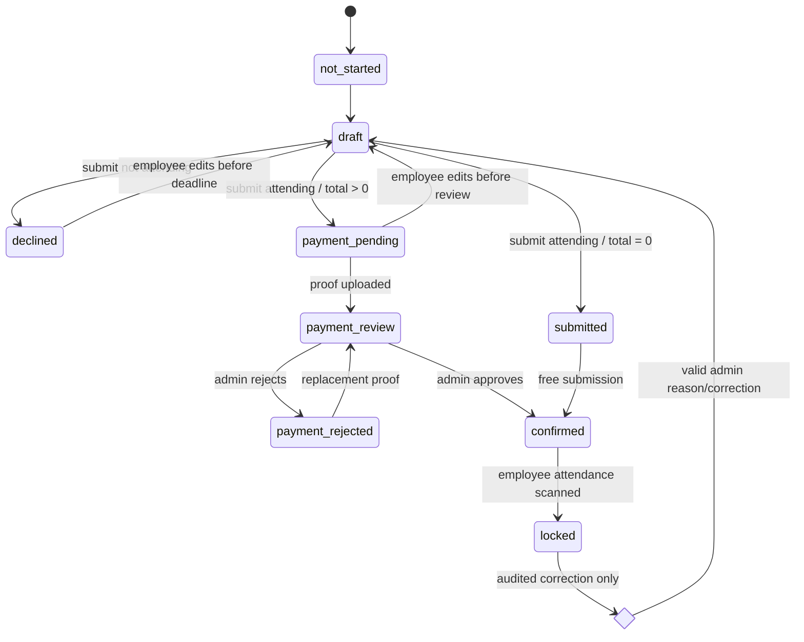
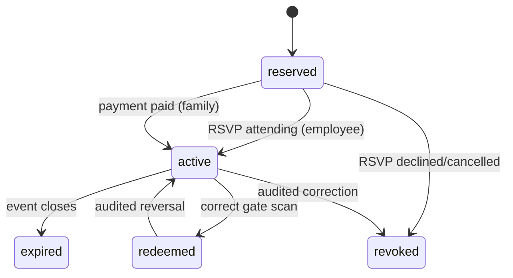
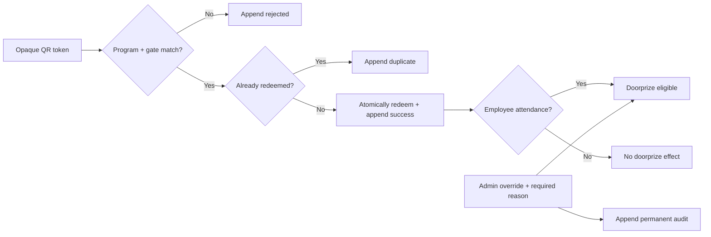

# SPS Corner v5.9.0 — Event Workflow Implementation Handoff

Last updated: 2026-07-12 (Asia/Makassar)  
Baseline commit: `4b0f3f4` (`v5.8.2`)  
Target release: `v5.9.0`

This document is the product and engineering source of truth for the Employee Gathering workflow. Do not silently change the locked decisions in section 12. Execution status lives in `task.md`.

## 1. Target workflow

1. Admin creates a program with structured event, RSVP, entitlement, price, and payment settings.
2. Admin previews recipients resolved from NIK, department, employee join-date cutoff, or their combination.
3. Publish validates the gathering, freezes recipients in `program_eligibility`, links one valid form/config version, and records an audit event atomically.
4. Eligible employees submit RSVP before the deadline.
5. `declined` ends without QR. `attending` immediately activates the employee attendance and meal entitlements.
6. S–XL are free; XXL/XXXL use the selected config-version price.
7. Family data is a count only. Each family member costs one configured package and receives an attendance QR plus meal QR after payment is paid.
8. Additional charges never hold the employee's base entitlements.
9. The scanner requires a selected program and gate. Every accepted, duplicate, rejected, or reversed attempt is appended to the scan ledger.
10. A successful employee-attendance scan (or an audited manual attendance override) is the only source of doorprize eligibility.
11. The dashboard and filtered Excel/PDF reports use the same server-side aggregate.

## 2. State diagrams

### RSVP and payment

Stored database values may keep compatibility aliases during rollout (`pending_payment`, `under_review`, `failed`), but API responses expose the canonical state and adapters must be tested before legacy aliases are removed.

### Entitlements

### Scan and doorprize

## 3. Data contract

### Program and recipient snapshot

- `union_programs`: structured `program_type`, `rsvp_deadline`, registration/benefit toggles, family-package price, shirt-price map, camping/doorprize flags, payment methods/accounts/QRIS, `config_version`, publication status/timestamps.
- `program_eligibility`: authoritative frozen recipient rows with source/filter snapshot, employee name/department/join date at publication time, snapshot version, and publication audit fields.
- A gathering cannot publish with no valid form, no RSVP deadline, deadline after start, or no recipients.
- Once an RSVP exists, snapshot changes require a dedicated admin reconciliation action with reason; ordinary edit cannot delete and recreate eligibility.

### Registration and price snapshot

- Canonical registration states: `not_started`, `draft`, `declined`, `submitted`, `payment_pending`, `payment_review`, `payment_rejected`, `confirmed`, `locked`.
- Items are calculated server-side from the active config version and stored as immutable snapshots at submit.
- Browser totals, user IDs, NIKs, price, and family QR counts are never trusted.
- Family count may change only before payment approval/review lock. Paid changes require an explicit correction/refund workflow.

### Entitlements and audit

- Codes: `employee_attendance`, `employee_meal`, `family_attendance`, `family_meal`.
- Lifecycle: `reserved`, `active`, `redeemed`, `expired`, `revoked`.
- Unique key: registration + entitlement code + beneficiary type + beneficiary index.
- QR payload is an opaque random token; no NIK or personal data is embedded.
- `program_coupon_redemptions` is append-only and stores success, duplicate, rejected, reversed, and manual override audit entries.

## 4. API contract

All writes require bearer authentication. Admin endpoints require `admin` or `superadmin`. The backend derives identity and prices from trusted data.

### Admin program lifecycle

- `POST /api/admin/programs/:programId/eligibility/preview` — resolve filters without writing a snapshot.
- `POST /api/admin/programs/:programId/publish-v2` — validate and atomically publish form/config/snapshot.
- `POST /api/admin/programs/:programId/eligibility/reconcile` — audited post-publication correction.
- `GET /api/admin/programs/:programId/workflow-report` — filtered dashboard source.
- `GET /api/admin/programs/:programId/workflow-report.xlsx` — report workbook.
- `GET /api/admin/programs/:programId/workflow-report.pdf` — branded PDF.

### Employee registration

- `GET /api/portal/programs/:programId/workflow-v2` — sanitized program/config/eligibility/deadline/status.
- `GET /api/portal/programs/:programId/registration-v2` — own registration, payment, and entitlements.
- `PUT /api/portal/programs/:programId/registration-v2/draft` — autosave an editable draft.
- `POST /api/portal/programs/:programId/registration-v2/submit` — server validation, price snapshot, and idempotent base entitlement issuance.
- `POST /api/portal/programs/:programId/registration-v2/payment-proof` — new/replacement controlled-storage proof.
- `GET /api/portal/programs/:programId/entitlements-v2` — employee/family attendance and meal cards.

### Payment, scan, and doorprize

- `POST /api/admin/program-registrations-v2/:registrationId/payments/:paymentId/approve`
- `POST /api/admin/program-registrations-v2/:registrationId/payments/:paymentId/reject`
- `POST /api/admin/program-registrations-v2/:registrationId/unlock`
- `POST /api/admin/program-entitlements/scan` — requires `programId`, gate, opaque token; appends audit for every result.
- `POST /api/admin/programs/:programId/attendance-override` — required reason and permanent audit.
- `GET /api/admin/programs/:programId/doorprize-eligible` — actual employee attendance only.

Legacy endpoints remain adapters during rollout. They must not issue V2 entitlements directly or accept client-calculated totals.

## 5. Backend module boundaries

The route layer only authenticates, validates request shape, calls a service, and maps errors. Business rules are isolated into:

- program eligibility and transactional publication;
- registration state and server-side pricing;
- payment review and proof replacement;
- idempotent entitlement issuance;
- redemption/override audit;
- doorprize eligibility;
- reporting aggregates and exports.

No new secret may be hardcoded. Service-role, storage, payment, mail, and AI credentials remain environment-only. API JSON 404 remains before the SPA fallback.

## 6. Form Studio and public renderer

- Desktop: field/template/AI library, live canvas, inspector; tablet panels collapse; mobile uses full canvas plus drawers/bottom sheets.
- Draft and publish are separate operations. Publish runs schema and workflow validation.
- Autosave records draft state and visible save status.
- Undo/redo uses bounded history; one accepted AI action is one undo step.
- Classic renders the complete visible form; Card renders one visible question/step with progress and clamped navigation.
- Builder preview and portal use the same renderer and conditional engine.
- AI must return validated structured actions. Text-only output is a suggestion, invalid schemas are rejected, and a diff is shown before apply.
- Publish rejects dangling condition targets, cycles, invalid outcomes, and accidental dead ends.

### Locked Employee Gathering template

Fields: attendance, shirt size, camping, bringing family, family count, cost summary, payment method/proof when total is positive, and consent. There is no family-name repeater.

## 7. Employee portal

The program detail shows eligibility, RSVP deadline, registration/payment status, server quote, bank/QRIS instructions, rejection reason and re-upload, and separate `Tiket Masuk` / `Kupon Makan` tabs. Each card shows employee or `Keluarga N`, lifecycle label, and the reason a reserved family entitlement is not active. Loading, empty, error, offline, and retry states are required on mobile, tablet, and desktop.

## 8. Reporting

One aggregate powers UI, Excel, and PDF: snapshot recipients; RSVP attending/declined/unanswered; shirts; camping; family count; billed/pending/paid/rejected; entitlement lifecycle; employee attendance/no-show; employee/family meals; doorprize eligible/winners; scan/override audit.

Excel sheets: Summary, RSVP, Payments, Entitlements, Scans, Doorprize. PDF uses the existing union logo, program identity, active filters, export time, summary metrics, and selected tables.

## 9. Security and authorization

- Server-authoritative identity, eligibility, deadlines, pricing, payment state, entitlement issuance, and scan transition.
- Admin role check on every admin workflow route.
- Proof upload allowlist, size limit, controlled bucket/path, and signed display URLs.
- Opaque high-entropy QR token; logs and responses do not leak service credentials.
- Retry/idempotency keys and database uniqueness prevent duplicate payments/QR.
- Append-only audit and mandatory reasons for overrides/reconciliation/unlock.
- Existing hardcoded Supabase credential fallback is tracked as a separate security remediation and must be removed without printing its value.

## 10. Migration, rollout, and rollback

1. Backup production schema/data and record the rollback point.
2. Run the idempotent Workflow V2 migration on staging.
3. Verify constraints, RLS, RPCs, and legacy coupon-column compatibility.
4. Deploy backend while legacy adapters remain active.
5. Pilot one gathering and execute the full acceptance suite.
6. Deploy frontend, then monitor API/PM2/Vercel errors.
7. Only then activate additional programs and remove audited dead paths.

Rollback before live writes may drop V2 objects in reverse dependency order. After any registrations/payments/scans, do not drop the schema: disable publication, preserve ledgers, deploy the previous application, and reconcile/export data first.

## 11. Acceptance criteria

- Invalid gathering publication is rejected; valid publication produces exactly one config version and frozen non-empty recipient snapshot.
- Non-eligible users cannot RSVP or receive entitlements.
- Declined gets no QR. Attending gets employee attendance and meal immediately even if additional payment is pending.
- XXL/XXXL and family package amounts match the server config snapshot.
- Family count N produces exactly N attendance plus N meal entitlements only after paid.
- Rejected proof can be replaced; repeat submit/approve/scan cannot duplicate records.
- Wrong gate rejects and logs; second scan logs duplicate; manual override requires role/reason.
- Only employee-attendance success or valid override makes a doorprize participant.
- Classic/Card branches, preview parity, AI diff/apply/undo, autosave, draft/publish, and all account selections work.
- Dashboard, Excel, and PDF totals match.
- `npm run lint`, `npm test`, and `npm run build` pass; kiosk/seller/cart/checkout/PPOB/non-gathering smoke tests have no regression.

## 12. Locked product decisions

- RSVP form and dedicated deadline are mandatory only for gathering programs.
- Recipient selection is frozen at publication.
- Employee attendance and meal become active immediately after an attending RSVP.
- Employee base entitlements are never held by shirt/family payment.
- One family package includes one attendance and one meal entitlement; family data is count-only.
- Family entitlements activate only after manual transfer/QRIS payment is approved.
- Doorprize uses actual employee attendance only; meal/family scans never qualify.
- Admin/superadmin may override attendance only with a permanent reasoned audit.
- Scanner selects program and gate before scan.
- Reports are available in dashboard, Excel, and branded PDF.

## 13. Audited baseline gaps (v5.8.2)

| Gap | Baseline status | v5.9.0 target |
|---|---|---|
| Migration 006 | Code exists; production previously reported missing tables | Supersede with verified idempotent migration and record staging/production evidence |
| Employee QR while additional payment pending | All entitlements currently held | Issue/keep employee base QR active immediately |
| Family data | Repeater/name template remains | Replace with integer family count |
| Program publish | Direct multi-write client flow; destructive eligibility/coupon replacement | Authenticated transactional backend publication |
| Config versioning | Existing active row may be mutated | Always create immutable new version |
| Scanner | Legacy `claim_program_coupon` RPC | Gate/program-aware V2 endpoint and append-only ledger |
| Doorprize | Reads legacy `doorprize` coupons | Read successful employee attendance/override audit |
| Proof replacement | Partial support exists | Explicit tested rejected-proof replacement |
| Form Studio | Three-panel shell exists | Complete draft/publish, undo/redo, AI diff/apply, validation parity |
| Payment account choice | First account rendered | Allow selection of every active account |
| Reporting | Registration review only | Unified dashboard plus Excel/PDF |
| Production rollout | No evidence in this workspace | Backup, staging, VPS health/log, frontend smoke evidence in `task.md` |

## 14. Error/gap history

- `WF-001 OPEN`: Workflow V2 database objects were reported missing in production (`PGRST205`) in the v5.8.2 handoff.
- `WF-002 OPEN`: Existing paid-addition logic holds employee QR, violating the locked entitlement rule.
- `WF-003 OPEN`: Gathering template stores family details/names despite the count-only requirement.
- `WF-004 OPEN`: Program publication performs client-side multi-writes and may leave partial state or delete active coupons.
- `WF-005 OPEN`: Scanner and doorprize still depend on legacy coupon/RPC semantics.
- `WF-006 OPEN`: There is no single reporting aggregate for UI/Excel/PDF.

Close an item only after code, automated/local verification, and any required environment deployment evidence are recorded in `task.md`.
